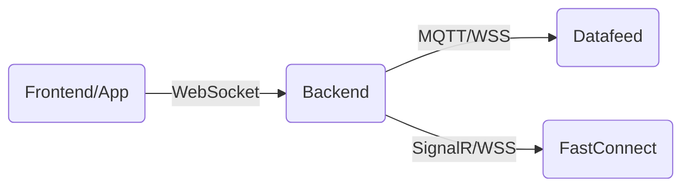

# Real-time Data Streaming Architecture

Để xử lý dữ liệu realtime cho DNSE và SSI, giải pháp tối ưu là sử dụng **WebSocket Proxy** trên FastAPI.

## Mô hình (Architecture)

## Giải pháp kỹ thuật

### 1. Endpoint
Tạo một WebSocket endpoint chung trên FastAPI:
`ws://domain/realtime/{source}/{symbol}`

### 2. DNSE (MQTT)
Sử dụng thư viện `paho-mqtt` để kết nối đến DNSE Broker (`datafeed-lts-krx.dnse.com.vn`).
- **Flow:**
  1. Backend dùng Account/Password (cấu hình trong env) để gọi API lấy Token & InvestorID.
  2. Kết nối MQTT với Username=InvestorID, Password=Token.
  3. Subscribe vào topic của mã chứng khoán (VD: `tick/symbol/VNM`).
  4. Khi nhận message từ MQTT -> Forward ngay lập tức vào WebSocket của Client.

### 3. SSI (FastConnect Streaming)
Sử dụng thư viện WebSocket client để kết nối đến SSI Streaming URL (`wss://fc-dataub.ssi.com.vn/...`).
- **Flow:**
  1. Backend lấy Access Token (như phần REST API).
  2. Tạo kết nối WebSocket đến SSI.
  3. Gửi message "switch" để đăng ký nhận dữ liệu mã (VD: `{"type": "register", "symbol": "VNM"}`).
  4. Nhận dữ liệu streaming -> Forward vào WebSocket của Client.

## Ưu điểm
- **Bảo mật**: Client không cần biết Token/API Key của SSI/DNSE.
- **Thống nhất**: Client chỉ cần code một chuẩn WebSocket duy nhất để nhận dữ liệu từ cả 2 nguồn.
- **Dễ bảo trì**: Logic kết nối, reconnect, parse dữ liệu nằm tập trung ở Backend.

## Các bước triển khai (Next Steps)
1.  Cài đặt thư viện: `pip install paho-mqtt websockets` (Đã có).
2.  Tạo file `routers/realtime.py`.
3.  Implement class `DNSERealtimeManager` để quản lý kết nối MQTT (Singleton để tránh tạo quá nhiều kết nối).
4.  Implement class `SSIRealtimeManager`.
5.  Gắn router vào `main.py`.
